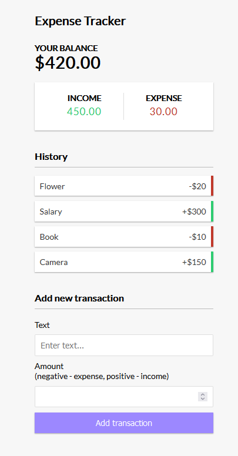

# React-Expense-Tracker

React Expense Tracker App

<!-- Live link to deployed app -->

Repository: https://github.com/Mdudzik92/React-Expense-Tracker 
Deployed app: https://dudzik-react-expense-tracker.herokuapp.com/

<!-- Technologies used -->

JavaScript, ES6, React.JS, React Hooks, Context API, JSX, CSS

<!-- Explanation of what the app is -->

This is a JavaScript Expense Tracker app which allows the user to keep track of their expenses and payments. The user can choose to either add a payment to the list or add a deduction from their payments in the form of an expense. They can also delete payments or expenses from the list, automatically updating the expenses or income totals.

The app utilizes the useState, useContext, and useReducer React Hooks & the Context API. It has a global state, global context, and passes everything down to the components. The transactions are in the global state and then pass them down into the components, then do the calculations inside the components.

<!-- Screenshot -->

<!-- License -->

MIT

<!-- Contact information -->

Email: mdudzik92@gmail.com
